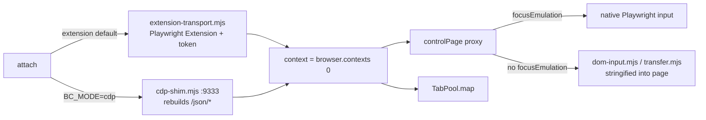

# Repository Guidelines

## Project Overview

`browser-control-kit` drives **the browser the operator is already using** — a real Chrome with a real profile, real logins, real extensions — instead of launching a blank automation profile. npm-workspaces monorepo, pure ESM `.mjs`, no build step, no TypeScript.

- `packages/browser-control` — published; transport attach + a puppeteer-flavoured page wrapper + a parallel tab pool. Only third-party dep: `playwright-core@1.63.0-alpha-2026-08-31` (exact pin).
- `packages/antd-kit` — private, zero-dep; `page.evaluate` helpers for Ant Design **v6** modals/drawers/forms.
- `packages/mcp-server` — `browser-control-mcp`, an MCP stdio server exposing the kit as agent tools; depends only on `browser-control`. Its surface is ten tools over **named surfaces** (`as` / `on`) — no tab handles, and no tool that opens or closes a tab.

Dependency direction is one-way and must stay that way: consumer suites → `antd-kit` → `browser-control` → `playwright-core`. `antd-kit` duck-types the `page` object; it has no dependency entry on `browser-control`.

## Architecture & Data Flow

Two transports, selected by `BC_MODE` (`DEFAULT_MODE = process.env.BC_MODE ?? "extension"`):



**Attach.** `attach()` → `loadToken()` (env `PLAYWRIGHT_MCP_EXTENSION_TOKEN`, else read-only `BC_TOKEN_FILE ?? ~/.config/browser-control/token`) → `connectViaExtension()` reaches `playwright-core/lib/coreBundle.js` `tools.resolveCLIConfigForMCP` + `tools.createBrowserWithInfo`. CDP then rides `chrome.debugger` per tab. `context` is always `browser.contexts()[0]` — never created. `probeCapabilities()` yields `{ mode, rawCdp, focusEmulation, browserPermissions }` and grants+clears one throwaway permission so the operator's profile is untouched.

**Capabilities are the single degradation switch**, threaded `attach → controlPage → TabPool`. On the extension transport there is no raw browser-target CDP, no `Browser.grantPermissions`, no `Emulation.setFocusEmulationEnabled`, and the attached tab reports `visibilityState=hidden` — so input falls back to DOM primitives.

**Page control.** `controlPage(page, capabilities)` returns a `Proxy`: overrides map first, otherwise `Reflect.get` + `value.bind(target)` (everything unlisted is raw Playwright). The DOM path runs `inAnyFrame(fn, args)` — main frame first, then every other frame — serialising the function with `fn.toString()` and rebuilding it in-page via `new Function`. First `{ ok: true }` wins; `reason === "not-found"` means "try the next frame", any other reason is the surfaced failure.

**Pool.** `new TabPool(context, { size, capabilities, prepare, reuse, mode }).start()` reclaims tabs marked `sessionStorage.bcPoolTab === "1"`, creates the rest only when allowed, and `map()` runs `min(size, items.length)` runners over a shared cursor. `map()` **never rejects** — failures land as `{ ok: false, error, ms, tab }`.

**cdp mode.** `npm run shim` serves `127.0.0.1:9333`: it reads `DevToolsActivePort`, holds **one** auto-reconnecting websocket to Chrome, rebuilds `/json/version`, `/json`, `/json/list`, `/json/new`, `/json/activate|close/<id>` on top of `Target.*`, **and proxies every automation client over that single socket** (hand-rolled RFC 6455 server in `src/ws-server.mjs`). `GET /shim/status` → `{ attached, reason, chrome, portFile }` is the shim's own diagnostic surface, not part of DevTools discovery, and is answered ahead of the Chrome round-trip so it still replies when Chrome is unreachable — that is how `attach({ mode: "cdp" })` tells "no shim" from "no `--remote-debugging-port`" from "waiting for the operator's Allow". This is load-bearing, not a nicety: Chrome prompts the operator to approve each new external CDP connection and never persists the answer, so advertising Chrome's own websocket URL would mean one dialog per `attach()`. Client ids are rewritten to shim-global ids; `/devtools/page/<targetId>` clients get a flat `Target.attachToTarget` session with `sessionId` injected inbound and stripped outbound. An unapproved Chrome 404s all `/json/*` and hangs the websocket handshake — that, not a disabled endpoint, is what the shim works around.

**Shim autostart.** `attach({ mode: "cdp" })` calls `ensureShim()` (both `ensureShim`/`probeShim` are exported from `src/attach.mjs`): it probes `BC_CDP_URL ?? http://localhost:9333` (`/json/version`, `BC_SHIM_PROBE_MS` = 1 s) and, when nothing answers, spawns `src/cdp-shim.mjs` **detached and unref'd** so it outlives this run, waiting up to `BC_SHIM_START_MS` (15 s). `BC_SHIM_AUTOSTART=0` turns a missing shim back into an error; a non-local `BC_CDP_URL` always errors. `capabilities.shim = { url, started, pid }` records whether the operator saw a dialog. The shim keeps its approved socket warm with a `Browser.getVersion` every `BC_SHIM_KEEPALIVE_MS` (30 s, `0` disables) — unref'd, and never fired before the first client, so it cannot pop the approval dialog on its own.

## Key Directories

| Path | Purpose |
| --- | --- |
| `packages/browser-control/src/` | All library code (10 modules, see below) |
| `packages/browser-control/test/` | `node:test` suites, flat, `<area>.test.mjs` (9 files; only `dom-input` and `pool` need a browser) |
| `packages/mcp-server/` | `browser-control-mcp`: MCP stdio server wrapping `browser-control` (`bin/`, `src/server.mjs` + `tools.mjs` + `transport.mjs`, `test/protocol.test.mjs`), its only dependency |
| `packages/antd-kit/` | Single-file `index.mjs`, antd v6 overlay helpers |
| `scripts/` | Local CI (`check.mjs`), hook installer, launchd shim installer, `crash-repro.mjs` |
| `examples/` | Runnable consumer sample, no npm script |

## Development Commands

```bash
npm i && node scripts/install-hooks.mjs   # one-time: git config core.hooksPath .githooks

npm test            # 10 suites in one process, --test-concurrency=1 (dom-input + pool need Chrome + token)
npm run test:offline # browserless tier: tab-guard (42) + ws-server (17) + shim-autostart (11) + shim-policy (6) + shim-recovery (19) + shim-service (8) + shim-session (12) + mcp protocol (25) = 140
npm run test:unit   # dom-input.test.mjs  (16 cases)
npm run test:pool   # pool.test.mjs       (8 cases)
npm run selftest    # end-to-end smoke; writes ./selftest.png, exits 1 on failure
npm run cleanup     # closes only tabs this tool left behind; supports --dry-run
npm run shim        # /json/* rebuild + CDP websocket proxy; only for BC_MODE=cdp
npm run shim:service # same shim as a launchd KeepAlive agent (--uninstall removes it)
npm run mcp         # MCP stdio server (packages/mcp-server/bin/browser-control-mcp.mjs)
npm run check       # full local CI: offline tier + browser suites
node scripts/check.mjs --offline          # what pre-commit runs

node --test --test-name-pattern="pierces an open shadow root" \
  packages/browser-control/test/dom-input.test.mjs
BC_CRASH_REPRO=1 node scripts/crash-repro.mjs evaluateOnExtensionPage   # deliberately kills Chrome
```

There is **no ESLint, Prettier, tsc, or bundler**. `scripts/check.mjs` is the entire CI; `.github/workflows/ci.yml` runs `node scripts/check.mjs --offline` on every push and PR on **macOS and Windows** — the supported platforms, because this kit drives the desktop Chrome the operator is logged into. Ubuntu runs the same tier as a non-blocking reference signal (`continue-on-error`); Linux is not a target. Branch protection requires the summary job named `check`, which gates on the macOS and Windows legs only. The browser tier cannot run on a hosted runner — no operator Chrome, no extension token:

1. `node --check` on every `*.mjs` (skips `node_modules` and dot-dirs — a `.js`/`.ts` file would silently escape it).
2. Rejects lines starting with `console.debug` or `debugger;`.
3. **Crash-guard string audit** — eight literals must survive in source: `BC_ALLOW_TAB_CREATE`, `MAX_TABS_EXTENSION`, `only ONE pool per connection`, `function wouldEmptyBrowser` in `src/pool.mjs`; `serialiseNavigation`, `BC_ALLOW_INIT_SCRIPT` in `src/page.mjs`; `protectedPages`, `wouldEmptyBrowser(` in `src/tab-guard.mjs`. Renaming them without updating `scripts/check.mjs` breaks pre-commit.
4. `LICENSE` exists and `packages/browser-control/package.json` `license === "MIT"`.
5. The browserless suites `tab-guard.test.mjs` (42), `ws-server.test.mjs` (17), `shim-autostart.test.mjs` (11), `shim-policy.test.mjs` (6), `shim-recovery.test.mjs` (19), `shim-service.test.mjs` (8), `shim-session.test.mjs` (12) and `packages/mcp-server/test/protocol.test.mjs` (25), each its own `step()`.

Browser tier is gated on a running-Chrome probe (`pgrep` on posix, `tasklist` on win32) plus a token; missing either → *skipped with a notice, exit 0*. Never blocks a push.

## Code Conventions & Common Patterns

- **Formatting** is `.editorconfig` only: UTF-8, LF, 2-space indent, trailing whitespace trimmed, final newline. Numeric literals use `_` separators (`30_000`). Prose is British-ish (`serialise`, `normalise`).
- **Zero-dependency reflex.** `sleep`, CRC32/ZIP, PNG bytes, CSV BOM, the semaphore — all hand-rolled. `const sleep = (ms) => new Promise((r) => setTimeout(r, ms));` is deliberately duplicated in `pool.mjs`, `cleanup.mjs`, `antd-kit/index.mjs`. **Do not factor out a shared util module.**
- **CommonJS interop** via `createRequire(import.meta.url)`; never `import` `playwright-core` statically.
- **Playwright internals are quarantined** in `src/extension-transport.mjs` ("THE ONLY FILE THAT TOUCHES PLAYWRIGHT INTERNALS"). Version bumps land there and nowhere else.
- **Errors**: `throw new Error("<full sentence naming the env-var escape hatch and why>")`, e.g. `` `click(${selector}) failed: ${res?.reason}` ``. Flatten with `String(err?.message ?? err).split("\n")[0]`. Expected failures use terse `catch {}` / `.catch(() => {})` **with a comment explaining why**.
- **Degraded ops return, not throw**: `{ skipped: true, reason: "attached-browser-keeps-its-own-size" }` (`setViewport`, `evaluateOnNewDocument`).
- **In-page primitives** (`dom-input.mjs`, `transfer.mjs`) are `UPPER_SNAKE` consts returning `{ ok: true, ... } | { ok: false, reason }` with stable reason strings (`not-found`, `zero-size`, `disabled`, `pointer-events-none`, `hidden`, `readonly`, `obscured-by:<TAG>.<class>`, `rejected-by-accept:<accept>`). They **must stay self-contained** — no imports, no closure captures — and `deepSrc` (then `transferSrc`) is always the **last** argument. Changing an arg list means changing `inAnyFrame` in `page.mjs`.
- **Multi-arg `evaluate` is emulated** (`applyInPage` + `new Function`) because Playwright accepts exactly one arg. Do not "simplify" it.
- **Config** is read inline at call time: `process.env.BC_X ?? default`, booleans as `=== "1"`, each flag documented in the adjacent comment.
- **Docs live in comments**, under hard limits — the repo's comment/code ratio is a reviewed number, and an unbounded version of this rule is what pushed `src` to 0.38. No `.d.ts`.
  - File header **≤ 12 lines**: the goal, the explicit non-goal, the single most important invariant. No stories, no analogies.
  - Incident notes are **one line**: `// 2026-09-05: <observed fact> → <resulting constraint>`. Dates, crash evidence and measured numbers **stay** — what gets compressed is the rhetoric, not the evidence.
  - **One-line `/** */` JSDoc** on exports; `@param {{…}}` only when the parameter is an options bag. Never restate what the function name already says.
  - Any single run of comment lines outside the header is **≤ 8 lines**. Longer means the function should be split, or the comment deleted.
  - Banned: narrating what the code does; aphorisms and second-person lecturing; the same fact stated both in the file header and at the function — keep the copy nearest the code.
  - Keep `NEVER`/`DANGEROUS` warnings, env-var escape hatches, and why a seemingly redundant guard exists. Test for everything else: delete the comment — would someone taking over in six months write a bug because of it? Yes → keep it, compressed to one line. No → delete it.
- **Reporting**: scripts accumulate `step(name, ok, detail)` records and print a single `JSON.stringify(report, null, 2)` at the end. No logger, no levels.
- **Module-level mutable state is process-wide**, not per-connection: `navChain` (`page.mjs`), `poolsStartedOnExtension` (`pool.mjs`), `socket`/`seq`/`pending` (`cdp-shim.mjs`).

### Crash-derived invariants — do not relax

Chrome 152 + Playwright Extension killed the browser process 11 times; each guard is load-bearing.

1. **Never `addInitScript` / `Page.addScriptToEvaluateOnNewDocument` on the extension transport** (browser-process `EXC_BREAKPOINT`). Gated by `BC_ALLOW_INIT_SCRIPT=1`; pool tabs are marked post-navigation with `evaluate` instead.
2. **Navigation is serialised process-wide** on extension (`navChain`); concurrent `goto` crashed Chrome. Everything else parallelises. Escape: `BC_PARALLEL_NAV=1`.
3. **Never close the last ordinary (non-`chrome-extension://`) tab** — Chrome exits and kills the bridge. Tab create/close is serial with a `BC_TAB_SETTLE_MS` (400 ms) settle.
4. **One `TabPool` per extension connection**; size ≤ `MAX_TABS_EXTENSION` (3) on extension, ≤ `MAX_TABS` (4) otherwise; `start()` throws with no ordinary tab present.
5. **Never touch the operator's tabs or profile**: reuse only `bcPoolTab`-marked tabs (`BC_REUSE_ANY=1` opts in), never `evaluate` on extension/devtools pages, `setViewport` is a no-op unless `BC_VIEWPORT=1`, the token is read but never written or echoed.
6. **Tab creation on extension requires `BC_ALLOW_TAB_CREATE=1`**; otherwise the pool degrades its size.
7. **Tab discipline is enforced, not requested** (`src/tab-guard.mjs`): `attach()` returns a guarded context whose `newPage()` recycles an idle owned tab before opening one, sizes every idle window from the caller's measured cadence (not constants), blanks idle tabs before closing them, adopts `window.open` popups, never counts or closes a tab that existed before attach, closes the relay's `connect.html` on teardown, and reclaims on `beforeExit`/`SIGINT`/`SIGTERM`. It deliberately does NOT probe system memory. The only refusal is the transport ceiling. `TabPool` calls `context.tabGuard?.hold()`. Opt out with `BC_TAB_GUARD=0`. Callers that need a page to survive bind a **named surface** (`guard.surface(name)`, `guard.release(name)`, `guard.surfaces()`): one page per name, exempt from recycling and reaping while bound, reusing an idle owned tab before opening anything. At the ceiling with every tab bound, the least-recently-used surface is released and its tab reused — reported via `stats.surfacesEvicted` / `report().surfaces`, never an error. The cadence answers "is this scratch tab idle?"; the name answers "is this page still wanted?".

### antd-kit specifics

antd **v6**: modal bodies are `.ant-modal-container` (v5's `.ant-modal-content` does not exist), and closed overlays stay mounted — so every helper calls `syncModal`/`syncDrawer`/`syncScope` first and scopes to `[data-qa-modal="active"]` / `[data-qa-drawer="active"]`. `clickButton` prefers exact whitespace-stripped text over substring (`一時保存` vs `一時保存を破棄`). Some selectors/regexes are Japanese by design.

## Important Files

| File | Role |
| --- | --- |
| `packages/browser-control/index.mjs` | Barrel: `attach, transportSupport, DEFAULT_MODE, controlPage, blockUrls, TabPool, parallelMap, MAX_TABS, MAX_TABS_EXTENSION, TabGuard, guardContext, guardBrowser, defaultBudget, makeXlsx, makeCsv, makePng, asUpload, extensionSupport, loadToken`. |
| `src/attach.mjs` | Transport choice + capability probe + shim autostart (`ensureShim`, `probeShim`; not re-exported by the barrel) |
| `src/extension-transport.mjs` | Token load + playwright-core private API (quarantine) |
| `src/cdp-shim.mjs` | `/json/*` rebuild + single-socket CDP proxy (browser endpoint and `/devtools/page/<id>` tunnel) + keep-alive, `127.0.0.1:${SHIM_PORT ?? 9333}` |
| `src/ws-server.mjs` | Dependency-free RFC 6455 server: `accept`, `upgrade`, `WsConnection`, `encodeFrame`, `decodeFrame` |
| `src/page.mjs` | `controlPage` Proxy, nav lock, frame fan-out, `blockUrls` |
| `src/dom-input.mjs` / `src/transfer.mjs` | Stringified in-page click/type/upload/drag primitives |
| `src/pool.mjs` | `TabPool`, `parallelMap`, tab ceilings, and the single source of `wouldEmptyBrowser`, `MARKER` (`bcPoolTab`) and `TAB_SETTLE_MS` |
| `src/tab-guard.mjs` | `TabGuard`: named surfaces (`surface`/`release`/`surfaces`, LRU release at the ceiling), recycling, measured idle windows, blank-then-close reclaiming, `guardContext`, `guardBrowser`, `tabCeiling`; imports the crash constants from `src/pool.mjs` |
| `src/fixtures.mjs` | `makeXlsx/makeCsv/makePng/asUpload`, hand-rolled ZIP+CRC32 |
| `selftest.mjs` / `cleanup.mjs` | Operator scripts (not published tests) |
| `scripts/check.mjs` | The CI |
| `scripts/install-shim-service.mjs` | Installs the shim as a launchd KeepAlive agent, capturing `SHIM_PORT`/`CHROME_PORT`/`CHROME_PORT_FILE`/`CHROME_HOST`/`BC_SHIM_KEEPALIVE_MS` into the plist; `--uninstall` removes it |
| `README.md` / `README.zh-CN.md` | English-first docs with a Chinese translation alongside; keep both in step |
| `CONTRIBUTING.md` | Setup, the two CI tiers, PR expectations |
| `packages/browser-control/ARCHITECTURE.md` | Design rationale (rewritten against the current tree) |

Subpath exports: `browser-control/fixtures`, `/pool`, `/tab-guard`, `/shim`. Adding a shipped file requires updating `files` **and** `exports` in `packages/browser-control/package.json`.

## Runtime/Tooling Preferences

- **Node ≥ 22** (global `WebSocket`). **Bun is unsupported** — its WS client cannot carry Playwright's CDP transport (`connectOverCDP` hangs at `<ws connecting>`).
- **npm** workspaces; `package-lock.json` is committed (CI runs `npm ci`) — lockfile changes belong in the commit. The root manifest is `private: true` but still carries `license`/`author`/`repository`/`homepage`/`bugs`.
- All source is `.mjs`. Do not introduce `.js`, `.ts`, or a build step.
- **Supported platforms are macOS and Windows** — the operator's own logged-in Chrome lives on a desktop, and CI runs the offline tier on both. Linux is not a target (it runs non-blocking in CI for information). Cross-platform where it counts: the shim resolves Chrome's user-data-dir per platform (`CHROME_PROFILE_DIRS` in `src/cdp-shim.mjs`, override with `CHROME_PORT_FILE`), and `scripts/check.mjs` probes for a running Chrome on win32/posix. `scripts/install-shim-service.mjs` is launchd-only and says so; `scripts/crash-repro.mjs` is macOS-only by design.
- Key env flags: `BC_MODE`, `BC_CDP_URL`, `BC_TRACE`, `BC_MAX_TABS`, `BC_MAX_TABS_EXTENSION`, `BC_TAB_SETTLE_MS`, `BC_ALLOW_TAB_CREATE`, `BC_REUSE_ANY`, `BC_PARALLEL_NAV`, `BC_VIEWPORT`, `BC_ALLOW_INIT_SCRIPT`, `BC_TAB_GUARD`, `BC_TAB_BUDGET`, `BC_TAB_RECYCLE_MS`, `BC_TAB_BLANK_MS`, `BC_TAB_IDLE_MS`, `BC_TAB_EVICT`, `BC_KEEP_BRIDGE_TAB`, `BC_TOKEN_FILE`, `PLAYWRIGHT_MCP_EXTENSION_TOKEN`, `SHIM_PORT`, `CHROME_PORT_FILE`, `BC_SHIM_AUTOSTART`, `BC_SHIM_KEEPALIVE_MS`, `BC_SHIM_PROBE_MS`, `BC_SHIM_START_MS`, `BC_SHIM_PROXY_TIMEOUT_MS`, `BC_CRASH_REPRO`.

## Testing & QA

Framework: built-in `node:test` (BDD) + `node:assert/strict`. No mocks, no snapshots, no coverage tooling, no reporters. Browserless: `tab-guard` (42), `ws-server` (17), `shim-autostart` (11), `shim-policy` (6), `shim-recovery` (19), `shim-service` (8), `shim-session` (12), and `packages/mcp-server/test/protocol` (25). Needing a running Chrome and an extension token: `dom-input` (16), `pool` (8).

`shim-recovery.test.mjs` pins the shim's recovery semantics: every pending call ends definitely (a timeout, the browser socket dropping, the client dropping all produce an id-matched error reply), a late real answer is neither delivered twice nor fatal, the `EADDRINUSE` loser exits 0 without ever having dialled Chrome — so losing the race costs no approval click — `/shim/status` still answers while Chrome is unreachable, and the three cdp `attach()` failures give three different messages. `shim-service.test.mjs` pins launchd plist generation: XML escaping that does not change the value launchd actually receives, `KeepAlive` paired with `ThrottleInterval` so a crashing shim cannot loop, and only the environment variables that were really set being captured. Its `plutil` cross-check is darwin-only and skips rather than fails elsewhere, because the offline tier runs on a Linux runner.

`shim-session.test.mjs` pins who gets which CDP event: a session a client opened itself (`Target.attachToTarget`, flattened) belongs to that client alone, a page client's nested session reaches the page client rather than the browser endpoint, ownership is given back on detach, on `Target.detachedFromTarget` and when the owner disconnects, and an event for a session nobody owns still reaches every browser-endpoint client instead of vanishing. Same hermetic shape as the two above: fake Chrome, real shim child, raw clients.

`--test-concurrency=1` is mandatory: the extension accepts exactly one client, so two parallel suite processes mean one cannot connect and the other is interrupted. One `attach()` per process.

Writing a new test:

1. Create `packages/browser-control/test/<area>.test.mjs`; open with a `//` header stating why it exists and the exact run command.
2. Import `{ after, before, describe, it }` from `node:test`, `assert` from `node:assert/strict`, and reach into `../src/<module>.mjs` directly (not through `index.mjs`).
3. `before()`: `const { browser, context, capabilities } = await attach();` then `controlPage(raw, { ...capabilities, focusEmulation: false })` to force the DOM-input path. `after()`: `await browser?.close()`.
4. Build page state with inline template-literal HTML + `page.setContent(...)` on `about:blank`; let the fixture's own `<script>` append to a `#log` div and assert via `page.evaluate`. Binary data comes from `src/fixtures.mjs` — pass `{ name, buffer }`; `normaliseFiles` handles base64.
5. Assert refusal reasons with `assert.rejects(() => page.click("#disabled"), /disabled/)`.
6. If the test creates tabs: set `process.env.BC_ALLOW_TAB_CREATE = "1"` in `before()` and first ensure an anchor non-`chrome-extension://` tab exists.
7. **Register the file in all three hardcoded lists — there is no discovery**: root `package.json` `scripts.test`, `packages/browser-control/package.json` `scripts.test`, and the suite array in `scripts/check.mjs`. A browserless suite also belongs in both `test:offline` scripts and gets its own `step()` in the offline tier of `scripts/check.mjs`, so it runs on every commit and in GitHub Actions.

`selftest.mjs` is the acceptance smoke (attach → navigate → background-tab input → screenshot), not a `node:test` file. Run `npm run cleanup` after test runs: tabs reused from a previous run are kept by design, and the guard's marker makes them findable.
